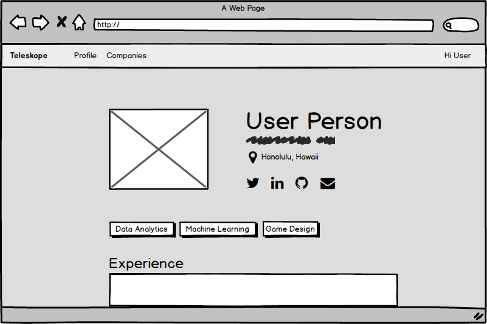
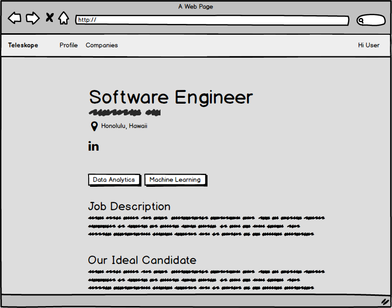

Visit our deployed page at [http://teleskope.meteorapp.com/](http://teleskope.meteorapp.com/#/)

# Table of contents

* [About Teleskope](#about-teleskope)
* [Installation](#installation)
* [Project Goals](#project-goals)
  * [Project Boards](#project-boards)
* [Mockups](#mockups)
* [Actors](#actors)
* [Routes](#routes)

# About Teleskope
Teleskope is an application that provides a new way for local and non-local companies who want to recruit students from UH to make their (potential) opportunities known to students. At the same time, students can create profiles on the site with their interests. The site can match students to employers and vice-versa.

# Installation
1. Install Meteor
2. Fork this repo
3. CD in to the project's app directory and install dependencies
> `$ meteor npm install`
4. Run the app
>  `$ meteor npm start`
5. Go to `localhost:3000` 

# Project Goals
* Students and Companies can create accounts. 
* Students can view recruiting companies and available positions. 
* Students can find companies that match their skillset & interests. 
* Companies can easily view interested students and receive emails. 

## Project Boards
* [Milestone 1](https://github.com/teleskope/teleskope/projects/1)
* [Milestone 2](https://github.com/teleskope/teleskope/projects/2)

# Mockups
## Landing page

## Company Index (logged in)

## Students Index (logged in)

## Student profile page

## Company profile page

## Job show

## Student Registration

## Company Registration

# Actors

* Student
* Company
* Administrator 

# routes 
- root (/) 
> root path will change depending on whether a user is authenticated as a Admin, Student or a Company. Landing page will be displayed if not logged in. 
- students
  - show profile (/students/:username) 
  - index (/students) **admin only**
- companies
  - index (/companies)
  - show (/companies/:id)
- jobs
  - index(/companies/:id/jobs)
  - show(/companies/:id/jobs/:jobid)
- settings 
  - edit profile (/settings/profile)
- Authentication
  - registration (/sign-up)
  - sign in (/sign-in)
