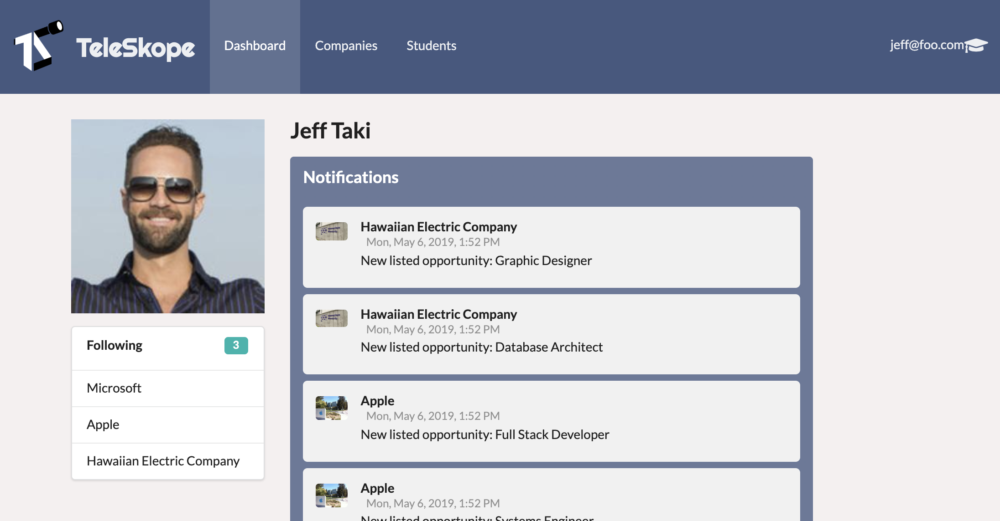
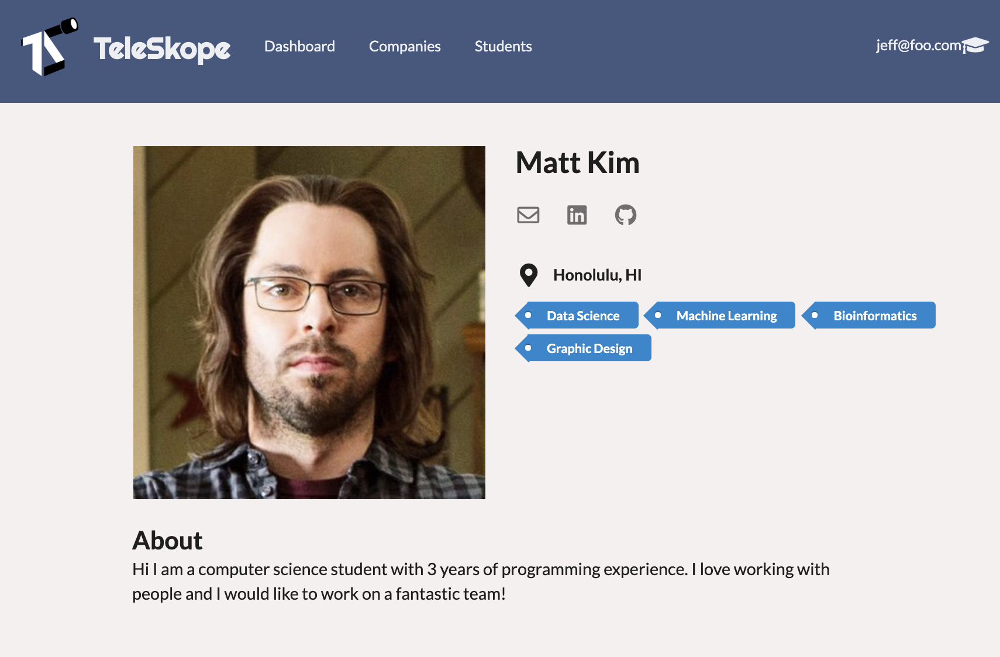

# Table of contents

* [About Teleskope](#about-teleskope)
* [Installation](#installation)
* [Project Goals](#project-goals)
  * [Project Boards](#project-boards)
* [Mockups](#mockups)
* [Actors](#actors)
* [Routes](#routes)

# About Teleskope
Teleskope is an application that provides a new way for local and non-local companies who want to recruit students from UH to make their (potential) opportunities known to students. At the same time, students can create profiles on the site with their interests. The site can match students to employers and vice-versa.

### Community Feedback
#### Jackie L.
1. Liked the how jobs cards are displayed on a companies page.
2. Did not like the fact that when you submit an account, it does not redirect you from the registration page.
3. Thought the follow function was very useful for keeping track of job postings.

#### Dan S.
1. Thought the CTA buttons like login, registraion, switch registration were easy to use. 
2. Liked how easy it was to follow a company 
3. Thought the sorting types would be more intuitive if they could be reversed as well. 
4. Thinks navigating to your own student profile should allow you to edit it instead of having to go to the /profile path. 

#### Reid D.
1.  Thought the colors and customer review on the landing page were nice, but thinks the reviews should be listed at the bottom and the statistics more centered.
2.  Would have liked to see links on the landing page, perhaps in the text or pictures to something like "exploring opportunities". 

### Visit our deployed page
[teleskope.meteorapp.com/](http://teleskope.meteorapp.com/#/)

### Check out our progress on our Project Boards
* [Milestone 1](https://github.com/teleskope/teleskope/projects/1)
* [Milestone 2](https://github.com/teleskope/teleskope/projects/2)
* [Milestone 3](https://github.com/teleskope/teleskope/projects/3)

### See our code on Github!
[github.com/teleskope/teleskope](https://github.com/teleskope/teleskope)

# Installation
1. Install Meteor
2. Fork this repo
3. CD in to the project's app directory and install dependencies
> `$ meteor npm install`
4. Run the app
>  `$ meteor npm start`
5. Go to `localhost:3000` 

# User Guide
This section will showcase the different pages on our site including what they do and what they look like!

### Landing
The landing page serves to welcome you to the site and direct you to register as a student or company while offering information about how the site is doing and who we are.

### Dashboard
The dashboard is the first page you are directed to once you log in. It serves as your hub for viewing any notifications you have about companies interested in you and companies you are following or students you are interested in if you are logged in as a company.

### My Profile
This page is for viewing everything about yourself. If you're a student it's your place that companies will find information about you to decide if they want to hire you. If you're a company it will show your company information and list your current openings.

### Companies
This page is for students to browse companies that are on the site that they might want to reach out to or express interest in. At the top of the page are displayed 3 comanies that match the user the best. Below is a sortable list of all of the companies. Users can favorite a company from this page or select a company to find out more.

### Job 
A user can see an individual job posting for a company, its description and click to link them to the online application protal. 

### Students
This page is for companies to browse students who they might want to reach out to given information listed in the jobs the company has available. Users can see other students, their skills, and experiences.

# Project Goals
* Students and Companies can create accounts. 
* Students can view recruiting companies and available positions. 
* Students can find companies that match their skillset & interests. 
* Companies can easily view interested students and receive emails. 

## Project Boards
* [Milestone 1](https://github.com/teleskope/teleskope/projects/1)
* [Milestone 2](https://github.com/teleskope/teleskope/projects/2)
* [Milestone 3](https://github.com/teleskope/teleskope/projects/3)

# Mockups
## Landing page

## Company Index (logged in)

## Students Index (logged in)

## Student profile page

## Company profile page

### Show Profile page (Logged in as owner of the company

## Job show

## Student Registration

## Company Registration

## Edit Company

## Add Job

# Actors

* Student
* Company
* Administrator 

# routes 
- root (/) 
> root path will change depending on whether a user is authenticated as a Admin, Student or a Company. Landing page will be displayed if not logged in. 
- students
  - show profile (/students/:username) 
  - index (/students) **admin only**
- companies
  - index (/companies)
  - show (/companies/:id)
- Profile (/profile)
- Dashboard (/dashboard)
- Authentication
  - registration (/signup)
  - sign in (/signin)
