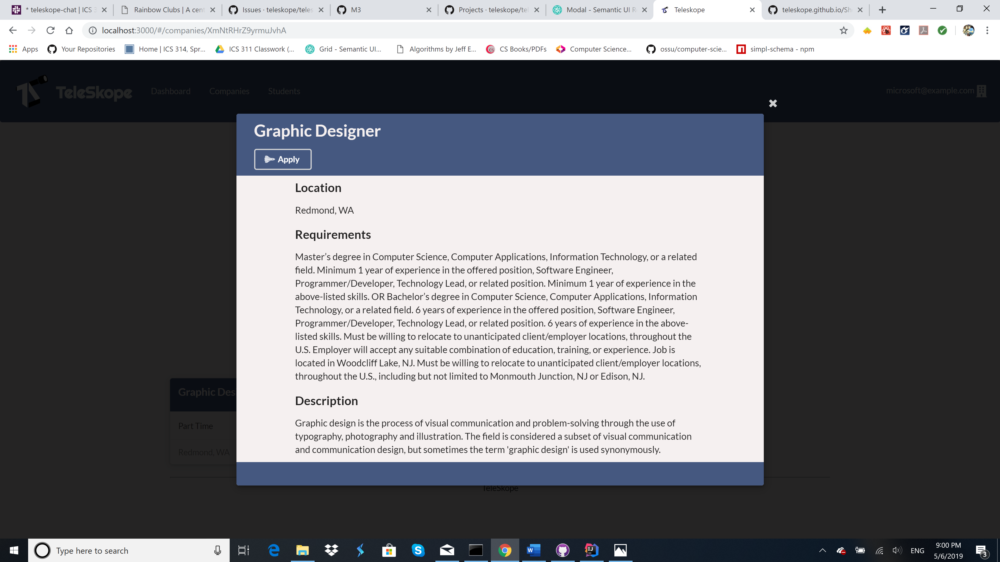

# Table of contents

* [About Teleskope](#about-teleskope)
* [Installation](#installation)
* [Project Goals](#project-goals)
  * [Project Boards](#project-boards)
* [Mockups](#mockups)
* [Actors](#actors)
* [Routes](#routes)

# About Teleskope
Teleskope is an application that provides a new way for local and non-local companies who want to recruit students from UH to make their (potential) opportunities known to students. At the same time, students can create profiles on the site with their interests. The site can match students to employers and vice-versa.

### Visit our deployed page
[teleskope.meteorapp.com/](http://teleskope.meteorapp.com/#/)

### Check out our progress on our Project Boards
* [Milestone 1](https://github.com/teleskope/teleskope/projects/1)
* [Milestone 2](https://github.com/teleskope/teleskope/projects/2)

### See our code on Github!
[github.com/teleskope/teleskope](https://github.com/teleskope/teleskope)

# Installation
1. Install Meteor
2. Fork this repo
3. CD in to the project's app directory and install dependencies
> `$ meteor npm install`
4. Run the app
>  `$ meteor npm start`
5. Go to `localhost:3000` 

# User Guide
This section will showcase the different pages on our site including what they do and what they look like!

### Landing
The landing page serves to welcome you to the site and direct you to register as a student or company while offering information about how the site is doing and who we are.

### Dashboard
The dashboard is the first page you are directed to once you log in. Similar to the landing page, it also acts as your hub for showing quick viewing of companies fit for you, or potential employees if you are logged in as a company.

### My Profile
This page is for viewing everything about yourself. If you're a student it's your place that companies will find information about you to decide if they want to hire you. If you're a company it will show your company information and list your current openings.

### Companies
This page is for students to browse companies that are on the site that they might want to reach out to or express interest in.

### Students
This page is for companies to browse students who they might want to reach out to given information listed in the jobs the company has available.

# Project Goals
* Students and Companies can create accounts. 
* Students can view recruiting companies and available positions. 
* Students can find companies that match their skillset & interests. 
* Companies can easily view interested students and receive emails. 

## Project Boards
* [Milestone 1](https://github.com/teleskope/teleskope/projects/1)
* [Milestone 2](https://github.com/teleskope/teleskope/projects/2)

# Mockups
## Landing page

## Company Index (logged in)

## Students Index (logged in)

## Student profile page

## Company profile page

## Job show

## Student Registration

## Company Registration

# Actors

* Student
* Company
* Administrator 

# routes 
- root (/) 
> root path will change depending on whether a user is authenticated as a Admin, Student or a Company. Landing page will be displayed if not logged in. 
- students
  - show profile (/students/:username) 
  - index (/students) **admin only**
- companies
  - index (/companies)
  - show (/companies/:id)
- jobs
  - index(/companies/:id/jobs)
  - show(/companies/:id/jobs/:jobid)
- settings 
  - edit profile (/settings/profile)
- Authentication
  - registration (/sign-up)
  - sign in (/sign-in)
